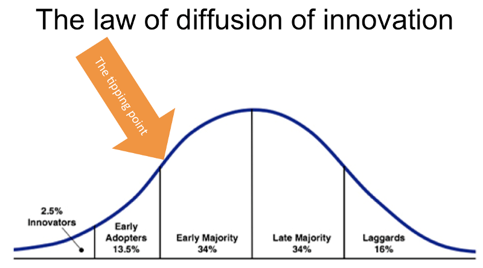

##Diffusion of Innovation Theory.

Key graph;

[]

` The Law of Diffusion of Innovations was explained Everett M. Rogers and pertains to the bell curve of product adoption. The curve outlines the percentage of the market who adopt your product, beginning with the Innovators (2.5%), followed by Early Adopters (13.5%), Early Majority (34%), Late Majority (34%) and Laggards (16%).`

###Links
- https://www.amazon.com/Diffusion-Innovations-5th-Everett-Rogers/dp/0743222091
- http://sphweb.bumc.bu.edu/otlt/MPH-Modules/SB/BehavioralChangeTheories/BehavioralChangeTheories4.html

